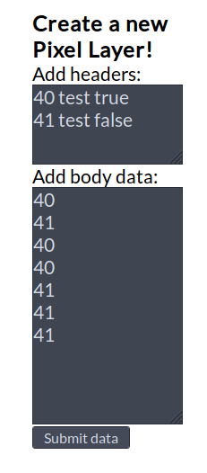

How to create a new pixel layer
---

The input boxes on the right of the main display can be used to add new data to be visualized. The only way new data can currently be added is by adding a new pixel layer (corresponding to a new attribute).

The input format has to be very specialized.

### Header format
Each line should contain a number, the name of the attribute, and `true`/`false`, in that order (separated by spaces). The number is the key that is used in the body input to represent that boolean value for this attribute.

### Body format
One number per line, each line representing the value of the attribute for an animal.

### Sample input

Header:
```
40 test true
41 test false
```

Body:
```
40
41
40
40
41
41
41
```
In the example above, the new data added represents the first 7 animals, with values of true, false, true, true, false, false, false, for the `test` attribute, respectively.


### Example image

