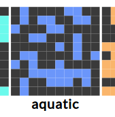
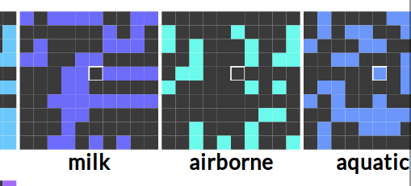
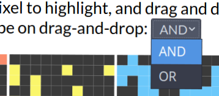
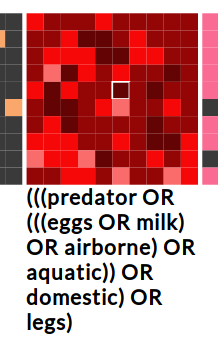

# Process Book

> NOTE: this is a WIP, and will most likely be heavily modified as the final deadline approaches.

Overview and Motivation
---
> Provide an overview of the project goals and the motivation for it. Consider that this will be read by people who did not see your project proposal.

Visualizing data with high cardinality in sets and elements per set using traditional visualization techniques can be difficult, since Venn Diagrams and Euler Diagrams and other visualizations quickly become overly crowded and complicated.

The OnSet data visualization method can handle a large number of sets and also large numbers of elements in each set in the dataset and the resulting visualization would still be comprehensible. It accomplishes this by representing each set independently through a PixelLayer, which can in turn hold a large quantity of elements. Usually a user would only want to compare several sets at once to find relationships, which can either be an OR operation or AND operation on multiple PixelLayers.

Our objective is to effectively implement the most significant aspects of the the OnSet visualization technique to accomplish the main functionality. The OnSet visualization technique we implement does not have to be exactly as in the research paper due to our time constraints of 4 weeks for this project, but the visualization should scale well for thousands of data points and many categories/sets, to see the relationship between categories/sets.
    
Related Work
---
>Anything that inspired you, such as a paper, a web site, visualizations we discussed in class, etc.

The original whitepaper at https://ieeexplore.ieee.org/stamp/stamp.jsp?arnumber=6876026&tag=1 had a lot of functionality that they implemented and reported, so that was our main inspiration.
    
Questions
---
> What questions are you trying to answer? How did these questions evolve over the course of the project? What new questions did you consider in the course of your analysis?

- How to represent data so that pixel layers and the interactions would be easy to implement and extend?
    - our representation changed multiple times throughout the entire project.

- What aspects of the data needs to be most apparent in the visualization and easy to discern?
    - the individual pixel layers representing each attribute, and the pixel corresponding to the same animal being highlighted in all pixel layers on mouse hover.

- What interactions would be most useful for the users?
    - the drag-and-drop is very crucial because that's the main way of differentiating large amounts of binary data in two different pixel layers.
    - Mouse hovering was also very important. People needed to be able to easily see which pixels correspond to the same element across multiple attributes.

- How would we represent data is an honest way?
    - use HSL coloring, and also AND/OR joins should work as expected. In order to further show the effect of the OR join, we implemented the different luminosities keeping the same hue, so that pixels that show more similarity between the combined pixel layers would be darker for easy viewing.
  
- How would users be able to add new data?
    - Users would be able to add data via an input box. We couldn't do server uploading, because the project was front-end only. The data format the users inputted was very important - we decided for DRY code, to have similar pattern to the cleaned csv data, and also decided to verify the data was of the proper format. We implemented several checks to make sure the data was of proper length and format, and also that it didn't conflict with existing data (eg. same keys or same attribute names).
    - Each new data input submission would create a new pixel layer, which was the best solution because it didn't disrupt the exisitng visualization and would be easy to distinguish.

Data
---
> Source, scraping method, cleanup, etc.
> 
Our example dataset of animal attributes came from https://dtai.cs.kuleuven.be/CP4IM/datasets/

This was a `.txt` file [here](/src/data/zoo-raw.txt). The steps to get it into usable data were as follows:

1. Due to the format of the text file, the first step was to split it into two sections, a section with the key corresponds the numerical data to labels/attributes (called the [header]((/src/data/zoo-header.txt))), and the actual data itself (called the [body](/src/data/zoo-body.txt)).
2. Convert both those text files to `.csv` format via [browserling](https://www.browserling.com/tools/text-to-csv). Result is:
   [header csv](/src/data/zoo-header.csv) and [body csv](src/data/zoo-body.csv).
   
3. Convert the tabular data to a good data representation using JS objects. In the code, we ended up deciding to use an object to represent headers, an array of elements representing pixels, and 

**Adding new data** See the [help guide](./help.md)
    
Implementation
---
> Describe the intent and functionality of the visualizations you implemented. Provide clear and well-referenced images showing the key design and interaction elements.

- PixelLayers displayed as 2D matrices from input data. Colors are unique(random HSL color) for every PixelLayer.
  
  

- Highlighting a pixel in one layer highlights the same one in other PixelLayers as well
    
    

- Drag and dropping PixelLayers onto each other calls AND/OR operational joins on the dataset of each PixelLayer

    

- Ability to easily switch between AND/OR joins via a dropdown control.
    

- OR joins have pixel luminosity determined by pixel frequency in the joined data.
  
    

    In addition, as seen above, each PixelLayer has a **label that is updated** as operational joins are performed on it and also **text wrapping** is supported

- Ability to add new PixelLayers to the visualization by importing new attribute data into the existing visualization

- In addition, we also took special care to make sure we supported both Chrome and Firefox, which was challenging because the two browsers had slightly different rendering behavior and window/event APIs differed slightly.

Timeline
---

### Update 1

- got basic data cleaning
  - convert boolean values to 0/1
  - complex aggregation of data to convert nested array of number/strings into objects
  - each object has a collection of values
  - currently only using `animals` data
- display pixel layers

### Prototype

- different colors for each pixel layers
- drag and drop handlers
- mouse hover highlighting
- added new data structure to handle layers to accomodate interaction
  - is an array of objects, each obj has a d3 selection representing a pixel layer, as well as a label (name, initially attribute), x/y location, and lastJoinType
  - two join types, in enum: AND, OR
- did a lot of re-architecting, refactoring, rewrote data structures, as we figured out how to represent data and display it better
  - data representations got more complex in order to accomodate all the extra features we were adding
- tough parts: finding out how to correspond the dom element with the d3 selection with the actual data it represents (used ids for comparison mostly)
- text wrapping for labels of pixellayers (wip)
- supporting multiple browsers (FireFox and Chrome work, IE and Edge are not reliable)

### Update 2

- used HSL colors instead of RGB for pixel layers
    - each new pixel layer is a random Hue
- implemented different shades of color for OR operations, like in the whitepaper
    - using uniform Luminosity scaling, for coloring best practices
- implemented text wrapping in the labels for combined pixel layers
    - via help from external npm lib (used Node.js + `package.json`), but on build creates a static JS file that is linked in main `index.html`
- add ability to input new pixel layers to data
    - b/c we don't have a backend server, we can't do file upload, so we'll use an input box

### Presentation

- create new pixel layers on new line
- add detailed documentation on how to create new pixel layers
- fix mouse highlighting bug not resetting on layer join
- _LOTS_ of refactoring
